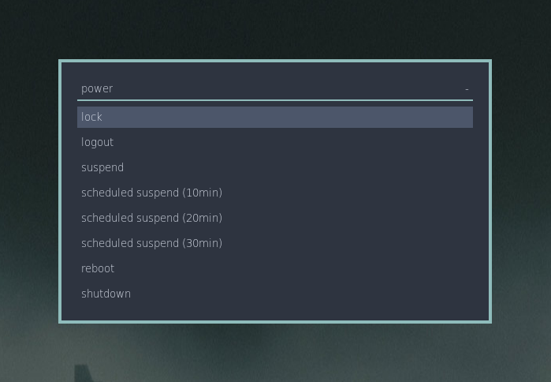

# rofi-menus
A small collection of rofi scripts to manage:
* shutting down
* screen brightness
* some xrandr settings
* scrot functions
* i3 layouts
---


## Prerequisites
* rofi
* scrot (only needed for scrotmenu)
* i3lock (only needed for powermenu, can be omitted or substituted for another screen locker)
* i3 (needed for i3layout)
* `systemctl` (systemd)

## Installation
```
mkdir -p ~/.config/rofi/scripts/ && cd ~/.config/rofi/scripts/
sudo mkdir -p /usr/local/bin/
git clone https://github.com/cramermarius/rofi-menus menus/
cd menus
```

## to install all scripts
```
chmod +x bin/* scripts/*
sudo cp bin/* /usr/local/bin/
sudo chown <username> /usr/local/bin/*menu/
```

## to install scripts one-by-one
### brightnessmenu
```
chmod +x bin/brightnessmenu scripts/brightnessmenu
sudo cp bin/brightnessmenu /usr/local/bin
sudo chown <username> /usr/local/bin/brightnessmenu
```

### i3layout
```
chmod +x bin/i3layout scripts/i3layout
sudo cp bin/i3layout /usr/local/bin
sudo chown <username> /usr/local/bin/i3layout
```

### powermenu
```
chmod +x bin/powermenu scripts/powermenu
sudo cp bin/powermenumenu /usr/local/bin
sudo chown <username> /usr/local/bin/powermenu
```

### scrotmenu
```
chmod +x bin/scrotmenu scripts/scrotmenu
sudo cp bin/scrotmenu /usr/local/bin
sudo chown <username> /usr/local/bin/scrotmenu
```

### xrandrmenu
```
chmod +x bin/xrandrmenu scripts/xrandrmenu
sudo cp bin/xrandrmenu /usr/local/bin
sudo chown <username> /usr/local/bin/xrandrmenu
```

## Usage
Because you copied some copied the contents of bin/ you can call these menus by simply
typing `<++>menu` in your terminal
You could also bind them to keybinds in your WM or DE, for i3 my binds are:

```
bindsym Mod4+Shift+x exec powermenu
bindsym F7 exec xrandrmenu
bindsym Control+F7 exec i3layoutmenu
bindsym F10 exec scrotmenu
```
## Setup
### brightnessmenu
```cat /sys/class/backlight/intel_backlight/max_brightness```
The integer that will get printed in the terminal is the number you need to put into
~/.config/rofi/scripts/menus/scripts/brightnessmenu.sh. in the lines you will see some
placeholder tags: <x%>, you will need to calculate the percentage of your max_brightness.
For me this would be: 416 * 0.02 for the 1st option or 416 * 0.6 for the 4th option. Now
the script should work normally. Keep in mind you will need sudo permissions for executing
this script as we are editing a system file.
file
### i3layoutmenu
This script should work out of the box if you are using i3.

### powermenu
This should work out of the box as well, assuming you are using i3 for the lock and logout
options, everything else should work as long as you have systemd. In case you want to use
i3lock with options as a colored background you can just add the flag to the command If
you don't have i3 you can easily swap out `i3lock` and `i3-msg exit` for something else.
You can also edit the sleep times for option 3 to 5 if you feel the need to.

### scrotmenu
If you have scrot installed this should work out of the box too. Keep in mind you
might want to edit the save locations for the command by editing the `cd` command
locations. 

### xrandrmenu
To configure xrandrmenu first make sure you have xrandr installed. Now type `xrandr` in
your terminal and look for the monitor names in the output. For me it is eDP-1 for my
laptop monitor and DP-1 for my external monitor. Now just replace <monitor0> in the
xrandrmenu.sh script with whatever output you like.

## Screenshots
Follow [this link](screens/) to view some screenshots.

## Acknowledgment
I took great inspiration for this from [vahnrr](https://gitlab.com/vahnrr/rofi-menus)

Some other cool rofi menus:
* [vahnrr's rofi-menus](https://gitlab.com/vahnrr/rofi-menus)
* [pandozer's rofi-clipboard-manager](https://bitbucket.org/pandozer/rofi-clipboard-manager)

## Meta
Marius Cramer – marcramer[at]pm[dot]me

[cramermarius/rofi-menus](https://github.com/cramermarius/rofi-menus)
