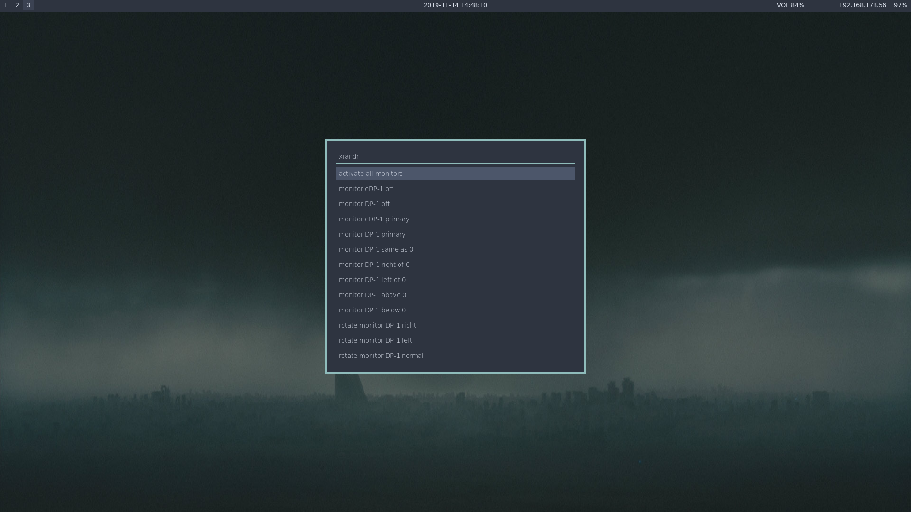
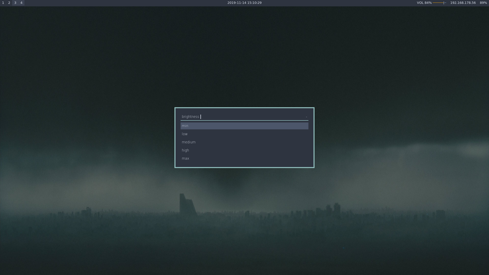
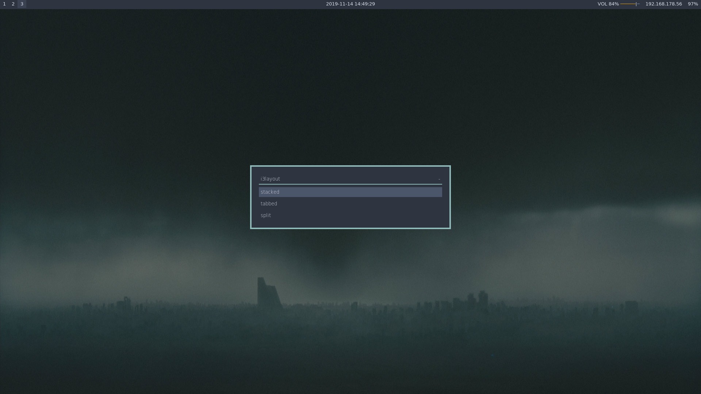

# rofi-menus
A small collection of rofi scripts to manage some basic utilities: 
* shutdown menu
* screen brightness menu
* xrandr menu
* scrot menu
* i3layout
---


## Prerequisites
* rofi
* scrot (only if you want to use `scrotmenu.sh`)
* i3lock-fancy (although this can be omitted if you remove the line from `powermenu.sh` or use another locker)
* i3 (just needed for `i3layoutmenu.sh`)

## Installation
`git clone https://github.com/cramermarius/rofi-menus/`

`cd rofi-menus`

`chmod +x scripts/*`

`sudo mkdir -p /usr/local/bin/`

`mkdir ~/.config/rofi/scripts/`

`cp scripts/* ~/.config/rofi/scripts/`

`cp bin/* /usr/local/bin/`

`sudo chown <username> /usr/local/bin/*menu`

`sudo chmod +x /usr/local/bin/*menu`

## Usage
If you follow the installation completely, you will not only have downloaded the scripts
themselves, but also bound them to a command so you can easily call them from the
terminal or bind them to a keybind in you WM or DE configuration.

So you can either call the rofi menus by calling their commands in a terminal, like so:

```powermenu``` or ```scrotmenu```.

<br>

Since I use i3, here are my binds concerning these menus:
```
bindsym Mod4+Shift+p exec powermenu
bindsym F7 exec xrandrmenu
bindsym Control+F7 exec i3layoutmenu
bindsym F10 exec scrotmenu 
```

## Configuration
If you have i3 installed `i3layoutmenu.sh` should work out of the box.<br>
If you have scrot installed `scrotmenu.sh` should work out of the box.<br>
If you have xrandr installed `xrandrmenu.sh` should work out of the box.<br>
If you have i3 (and i3lock-fancy) as well as systemd `powermenu.sh` should work out of the
box.<br>

In any case, with some light tinkering you can get all those menus to work with your
system configuration, just swap out the specific commands. If you encounter any hurdles,
feel free to open a GitHub issue.

`brightnessmenu.sh` is where things might go sour for OOTB-compatibility. You will need to
change the path to your specific `brightness` file, there should also be file in the same
directory called something along the lines of `max-brightness`, in it you will find your
monitors maximum brightness setting. This number will have to be set in the `$option4` (or
max) option, the rest of the options are just numbers I (or you) feel comfortable with, so
just experiment around a bit with those.

## Screenshots






## Acknowledgment
I took inspiration for this from [vahnrr](gitlab.com/vahnrr/rofi-menus)

Some other cool rofi menus:
* [vahnrr's rofi-menus](gitlab.com/vahnrr/rofi-menus)
* [pandozer's rofi-clipboard-manager](https://bitbucket.org/pandozer/rofi-clipboard-manager/src/master/)

## Meta
Marius Cramer – marcramer[at]pm[dot]me

[cramermarius/rofi-menu](https://github.com/cramermarius/rofi-menus/)
